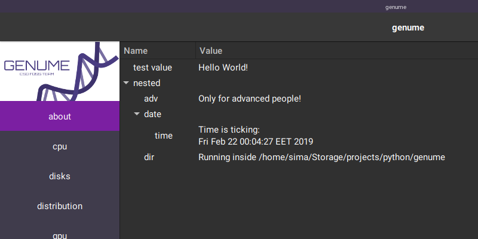

# Bash protocol

## Available commands

### configure

This command takes any number of arguments, which are the names of the commands your script requires to run. By default if a command is not available your script terminates execution. This behavior can be changed by specifying the `--nonfatal` optional flag. In this case configure returns a non-zero code and your script will continue execution normally.

### gset

This command takes any number of optional arguments. The name of each argument is the key and the argument of the argument is the value to set the key to.

### subcat

This command takes one optional positional argument which is the path of the subcategory to switch into. If no argument is given, then we switch into the root category. Also the optional argument `--advanced` can be used to mark this category as advanced.

### value

This command takes 2 or more positional arguments. The first one is always the key, and the concat of the rest is the value which will be displayed. The optional argument `--advanced` can be used to mark this value as advanced. Finally `--subcat` takes a path in which the value will be stored. This has the same syntax as the path of `subcat`, however the effect is only temporary.

## Example script

```sh
#!/bin/bash

# Specify required commands.
configure date pwd
# Add description(optional).
gset --description="I am the description!"
# Obligatory hello world.
value test_value Hello World!
# Changing subcategory.
subcat nested
value --advanced adv 'Only for advanced people!'
subcat
# Temporary subcategory.
output=$(date)
value --subcat .date time "Time is ticking:"
value --subcat .date time "${output}"
# Execute command inside string.
value --advanced dir "Running inside $(pwd)"
```

This results in the following output:

